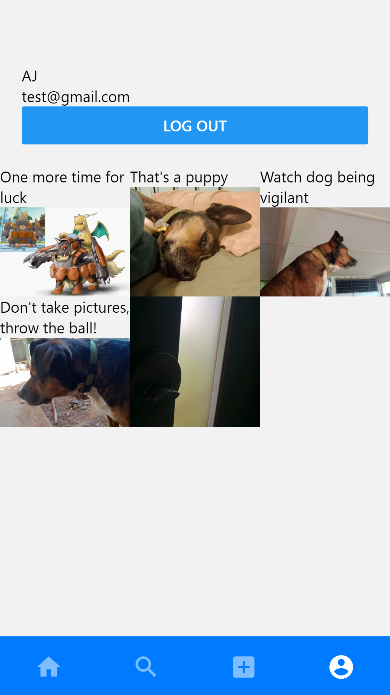

# React Native Photo App
## Description
This is a mobile app that uses React Native and firebase to take photos and share them in the cloud. Currently not publicly deployed.

## Screenshot

## Installation
First you will need to install the Expo app from a mobile app store.

There are currently two options to run this app on your own phone.
### Option 1. Give me an interview 😁
* Organise a meeting with me and I can host the webpack on my laptop.
    1. Put your mobile device on the same network as my laptop
    2. Scan the QR code on my laptop screen
### Option 2. 
* Fork this repo. 
    1. Create a firebase account
    2. Add your firebase API details into this app
    3. Install expo-cli with `npm install -g expo-cli`
    4. Run `expo start` and then wait for the webpack to compile
    5. Scan the QR code on your computer screen

## Contact
[Github Profile](https://github.com/Andrew836-dev)

Please feel free to email me at andrew.aj.gray@gmail.com
